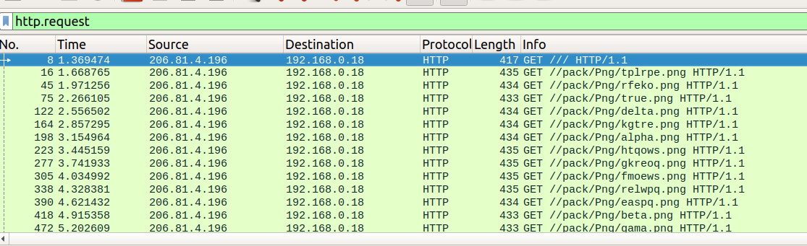
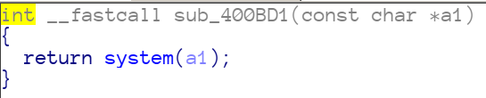
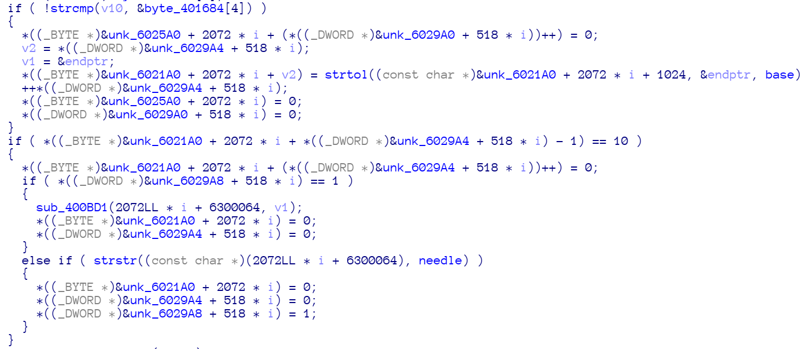

# Pwn2Win CTF - 2019

## Reversing, Networking / 279 - I Shall Never Be Anything

> After testing with meaningless packets, honeypots are now receiving completely normal packets, but they are executing malicious actions! Find out how the HARPA members are able to send commands through legit packets! Oh, we also found a malware in our honeypots, we believe it has relationship with those packets.
> [link](./malware.tar)


### Solution

By [@afcidk](https://github.com/afcidk)

The given tar file consists of a packaet capture file and a binary.  
We take a quick glance at `packet.pcap` first, and found that the server received many requests. It seems that no clues can be found here now.



After that, we decided to analyze the `malware`, and found that what the malware actually does is listening to `/var/log/apache2/access.log` and does something magic upon receiving new requests.

Also, we've found there's a `system` call inside the malware, so we guess that the main point of the malware is to sniff the requests, and then transform the requests to the argument of `system` function call.


The main logic to process the requests is a little bit messy. (It should be easier to analyze dynamically with gdb.)



We've transffered the messy code to code with better readibility which looks like:
```python=
alpha_num = "0123456789abcdefghijklmnopqrstuvwxyz"

for i in range(0x24): # test input_url
    if input_url == file[k]:
        tmp[tmp_counter] = alpha_num[k]

if input_url == '/':
    tmp[tmp_counter+1] = 0
    payload[payload_counter] = strtol(tmp,...., 13)
    ++outer_counter
    tmp[0] = 0
    tmp_counter = 0

if payload[payload_counter] == '\n'(10):
    if key == 1:
        system(payload)
        payload[0] = 0
        payload_counter = 0
    elif "b4v4r14ns" in payload:
        payload[0] = 0
        payload_counter = 0
        key = 1
```

Okay, now we've solved the major part of this challenge, but the relationship between requests and alpha_num is still not clear (line 4). We need to look at the capture file again.

We've collected the requests in the capture file and sort them in ascending order.

```
0x0 /pack/Png/alpha.png HTTP/1.1
0x1 /pack/Png/beta.png HTTP/1.1
0x2 /pack/Png/delta.png HTTP/1.1
0x3 /pack/Png/easpq.png HTTP/1.1
0x4 /pack/Png/fmoews.png HTTP/1.1
0x5 /pack/Png/gama.png HTTP/1.1
0x6 /pack/Png/gkreoq.png HTTP/1.1
0x7 /pack/Png/htqows.png HTTP/1.1
0x8 /pack/Png/kgtre.png HTTP/1.1
0x9 /pack/Png/relwpq.png HTTP/1.1
0xa /pack/Png/rfeko.png HTTP/1.1
0xb /pack/Png/tplrpe.png HTTP/1.1
0xc /pack/Png/true.png HTTP/1.1
```

All clues are clear now. We have the [request](./request) and the mapping(shown above), so we can write the script see what happened.

```python=
#!/usr/bin/env python3

with open('request') as f:
    request = f.read().split('\n')[:-1]

mapping = [ 
    "/pack/Png/alpha.png HTTP/1.1",
    "/pack/Png/beta.png HTTP/1.1",
    "/pack/Png/delta.png HTTP/1.1",
    "/pack/Png/easpq.png HTTP/1.1",
    "/pack/Png/fmoews.png HTTP/1.1",
    "/pack/Png/gama.png HTTP/1.1",
    "/pack/Png/gkreoq.png HTTP/1.1",
    "/pack/Png/htqows.png HTTP/1.1",
    "/pack/Png/kgtre.png HTTP/1.1",
    "/pack/Png/relwpq.png HTTP/1.1",
    "/pack/Png/rfeko.png HTTP/1.1",
    "/pack/Png/tplrpe.png HTTP/1.1",
    "/pack/Png/true.png HTTP/1.1",
]

base = 13
cur = []
for r in request:
    if r not in mapping:
        if len(cur) == 0: continue
        elif len(cur) == 1:
            cur = [0]+cur
        print(chr(cur[0]*base+cur[1]), end='')                                                                                                                               
        cur = []
    else:
        cur.append(mapping.index(r))
```

Result:
```
b4v4r14ns

echo 'CTF-BR{b3b3b3b3b3h4v10r}'
```
