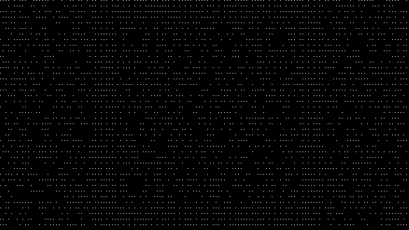
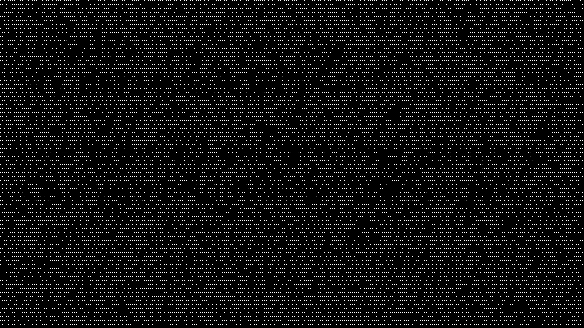

# SECCON CTF Quals - 2019

## Misc / 279 - Sandstorm 

> I've received a letter... Uh, Mr. Smith?
> 

### Solution

By [@afcidk](https://github.com/afcidk)

From the provided image, we can guess that this challenge is related to Adam7, which is an interlacing scheme for PNG images. Adam7 has seven passes, so I decide to generate those seven subimages first, and see if there is any clues.

I wrote a simple script to transform the original [sandstorm.png](./imgs/sandstorm.png) to seven images using Adam7 algorithm.

Level 1:

Level 2:

Level 3:

Level 4:

Level 5:

Level 6:

Level 7:

The flag is encoded to QR code in Level-1 subimage, `SECCON{p0nlMpzlCQ5AHol6}`.

### Reference

* [Adam7 algorithm](https://en.wikipedia.org/wiki/Adam7_algorithm)
